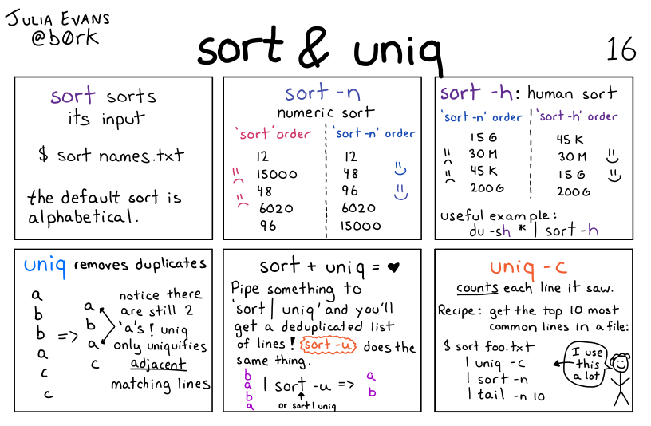
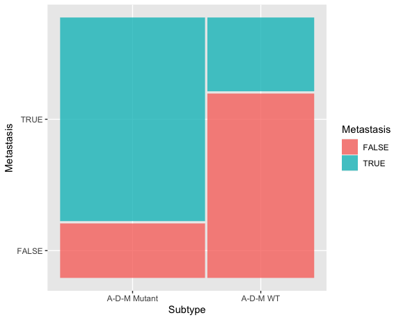

# Data Analysis for Molecular Biology and Biochemistry
## MBB 110

### Introductory data analysis focusing on molecular biology data sets and examples and including basic programming skills using Python and basic statistics skills using R. Prerequisite: MATH 12 or equivalent is recommended. Students with credit for MBB 243 may not take this course for further credit. CMPT 120 will be accepted in lieu of MBB 110.

## Topics

* Flavours of data in molecular biology and biochemistry
* Genomic data
* Fundamentals of R and Python
* Regular expressions and patterns
* Quantitative DNA/RNA sequence analysis
* Exploratory data analysis in the Tidyverse
* Generic visualization methods using ggplot2
* Advanced visualizations for molecular biology

## INSTRUCTOR:
### Sophie Sneddon ~ Bioinformatician, video game enthusiast, and cat person

