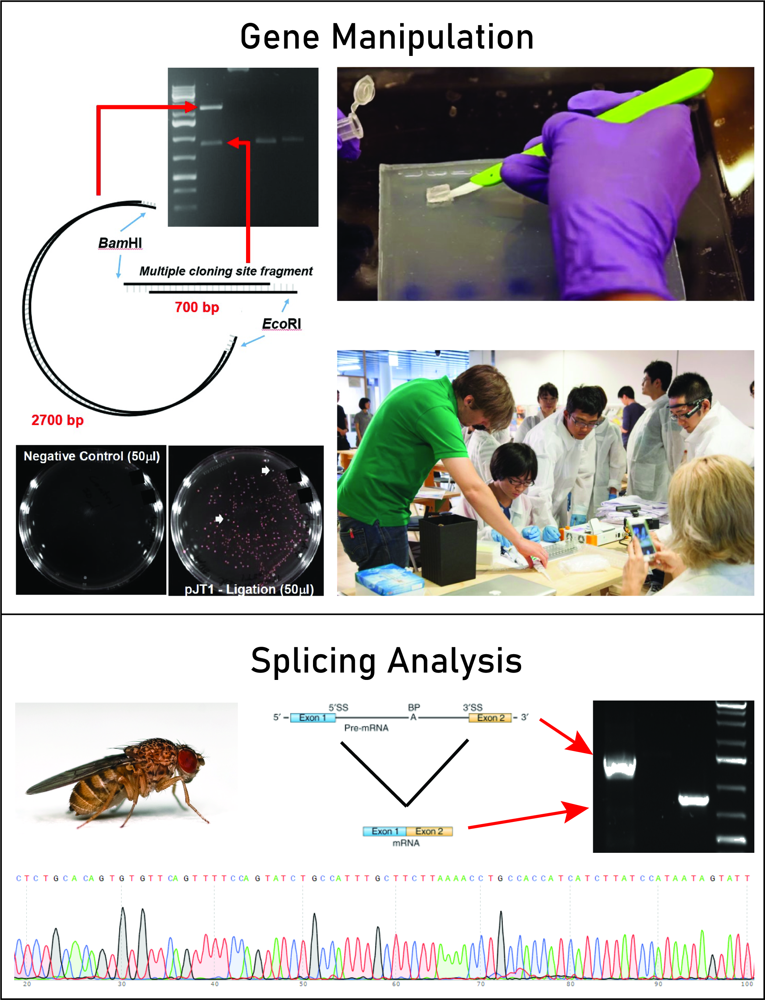

# Molecular Biology Laboratory
## MBB 308

### The exercises in this laboratory course are designed to introduce students to a variety of nucleic acid isolation and manipulation techniques that are currently used in a research environment. The main topics will include: (1) Gene manipulation - we will use mutagenesis to change the colour of a fluorescent protein from red to orange and (2) DNA/RNA extraction - we will explore the splicing of several Drosophila genes. In this course, students will perform their own experiments and develop a “toolkit” of technical expertise. One-on-one discussions with colleagues and the teaching team will also allow students to gain first-hand experience analyzing, discussing, and troubleshooting real-world scientific data.

## Techniques

* DNA and RNA isolation
* Plasmid preparation
* Restriction enzyme digestion
* Molecular cloning
* Gel electrophoresis 
* Polymerase chain reaction
* Site-directed mutagenesis
* Bacterial culture
* Sequence analysis

## INSTRUCTOR:
### Timothy Audas

