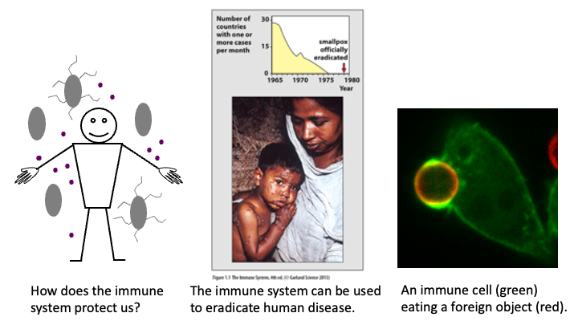

# Introduction to the Immune System
## MBB 326

### This course will provide an introduction to the structure and function of the immune system and how this system protects against microbial infections. Specific topics include innate immune responses, including the function of innate immune cells, receptors and complement, and adaptive immune responses, including the organization of lymphoid organs, development and function of T and B cells, and antibodies.  The impact of the immunological processes discussed on human health will also be discussed, with a focus on how vaccines work. 

## Topics

* Innate immune responses – Immediate responses to infections
* Innate immune responses – Induced responses to infections
* Antibody structure and development
* B cell development
* T cell receptor structure and development
* Antigen presentation to T cells
* T cell development
* T cell activation and clearance of pathogens
* B cell activation and effector functions of antibodies
* Immune memory and vaccination

## INSTRUCTORS:
### Jonathan Choy ~ This space for rent

### Mark Brockman ~ Virologist, immunologist, hypnotist

### Ingrid Northwood ~ That's Dr. Northwood to  you

### Mani Larijani

### Nienke Van Houten

