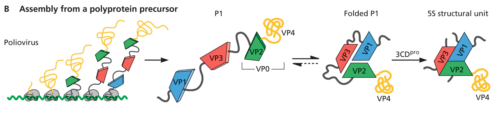
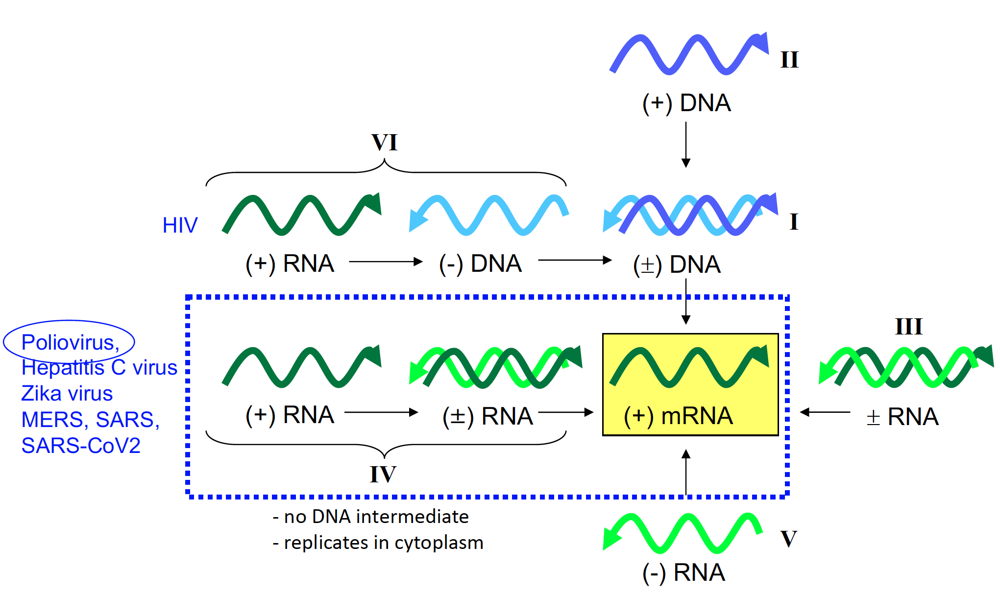
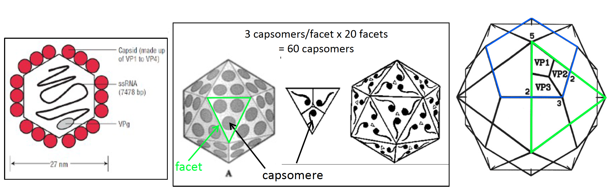
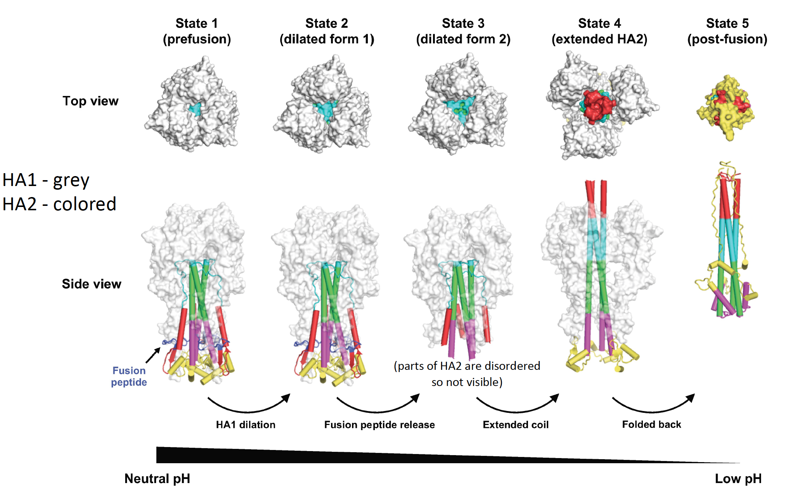
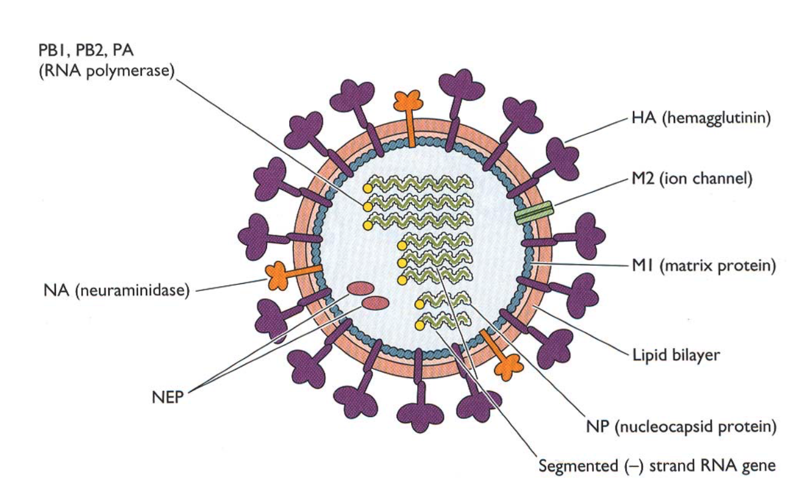

# Introduction to Microbial Pathogenesis
## MBB 328

### Are you curious how pathogens cause disease? Do you want to learn about different pandemics throughout human history? In this class, we will examine the molecular mechanisms by which microbial pathogens colonize the human body and cause disease. Emphasis will be placed on selected microbes and their structure/morphology, genetics, virulence factors, secretion systems, toxins and surface adhesions. Strategies for combating microbial infections, including antibiotics, antiviral agents and vaccines, will be discussed in detail.

## Topics

* Selected viral pathogens: Polio virus, Coronaviruses including SARS-CoV2, Influenza, HIV, HPV, HSV
* Antiviral agents and resistance mechanisms
* Selected bacterial pathogens: Listeria monocytogenes, Streptococci, Enterococci, Staphylococcus aureus, Pseudomonas aeruginosa, pathogenic E. coli, Klebsiella pneumoniae
* Antibiotics and resistance mechanisms
* Vaccines
* Human microbiota

## INSTRUCTOR:
### Amy Lee

### Systems biologist, lover of data, food & art

