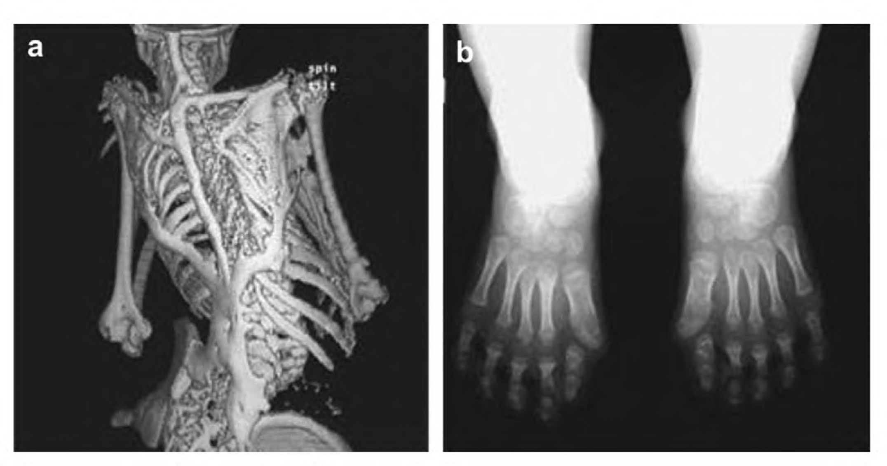
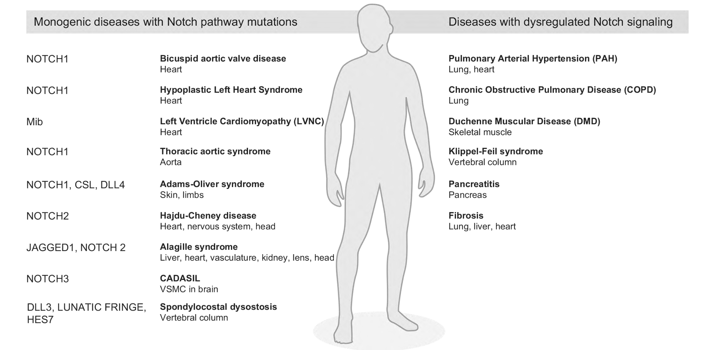
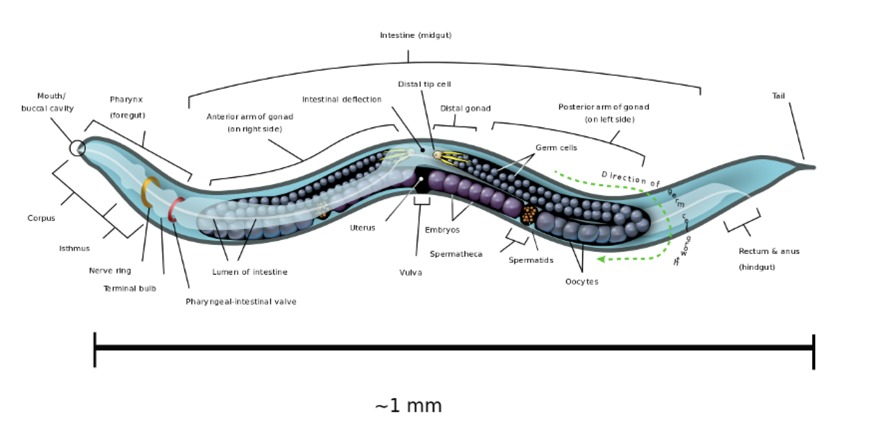
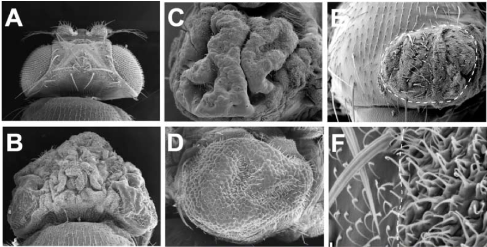

# Cell Signaling in Development and Disease
## MBB 402

### Cell signaling is essential for development in multicellular organisms and when misregulated can lead to development defects and disease. This course examines several highly conserved cell signaling pathways in both model organisms and vertebrates and delves into a mechanistic understanding of pathway regulation using molecular, genetic, biochemical and cell biological approaches. There is a focus on dissecting key papers from the primary literature and learning about human defects and disease through class presentations.

## Topics

* Experimental approaches to study signal transduction
* Role of model organisms
* Notch signaling
* Wnt signaling
* Hippo signaling
* Hedgehog signaling
* Cilia in signaling
* Defects, diseases, and cancer in signaling pathway mutants

## INSTRUCTOR:
### Nancy Hawkins

### Hiking enthusiast and Toronto Blue Jays fan

