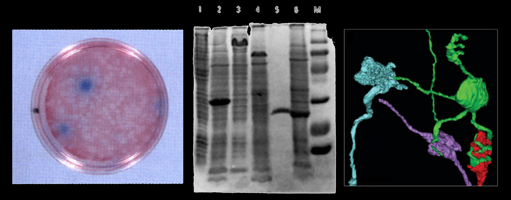

# Advanced Molecular Biology Techniques
## MBB 432

### Students conduct research projects that probe the molecular mechanisms of gene and protein activities

## Research Projects

* Analysis of gene function by site-directed mutagenesis or mutagenesis screens
* Determination of protein localization by fluorescent protein fusions and bimolecular fluorescence complementation
* Identification of protein interactions by co-precipitation of protein complexes
* Screens for genetic and physical interactions by yeast two-hybrid screens and high-copy suppression

## INSTRUCTORS:
### Christopher Beh

### Lab coach

