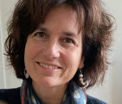
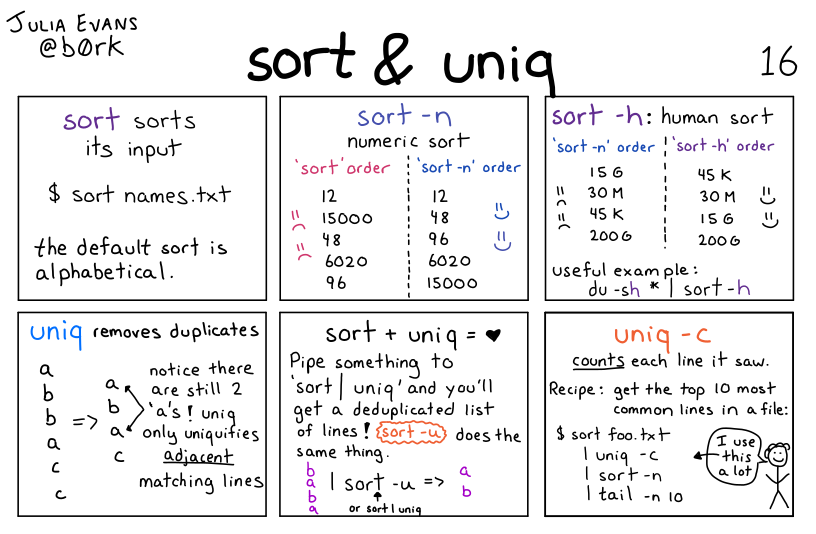
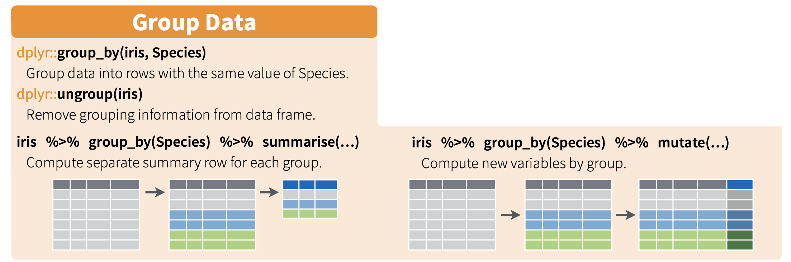
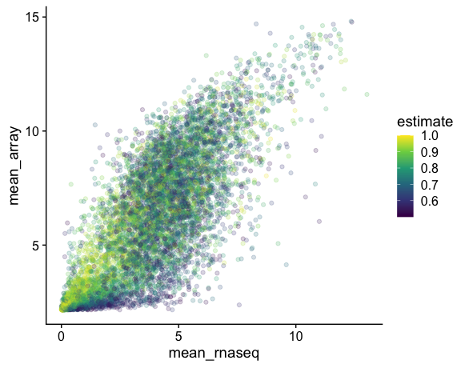
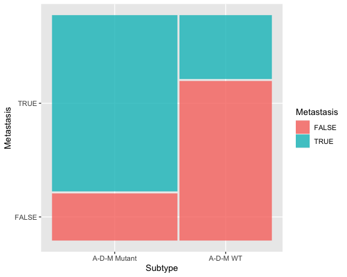

# Human Molecular Genetics
## MBB 438

### We talk about a diverse range of topics related to human genetics and genetic diseases. 

## Topics

* Human genetic disease
* Disease gene mapping and characterization
* Gene therapy using Crispr
* Cloning and stem cells
* Genetic counselling
* Cancer genetics
* Animal models of disease

## INSTRUCTOR:
### Esther Verheyen

