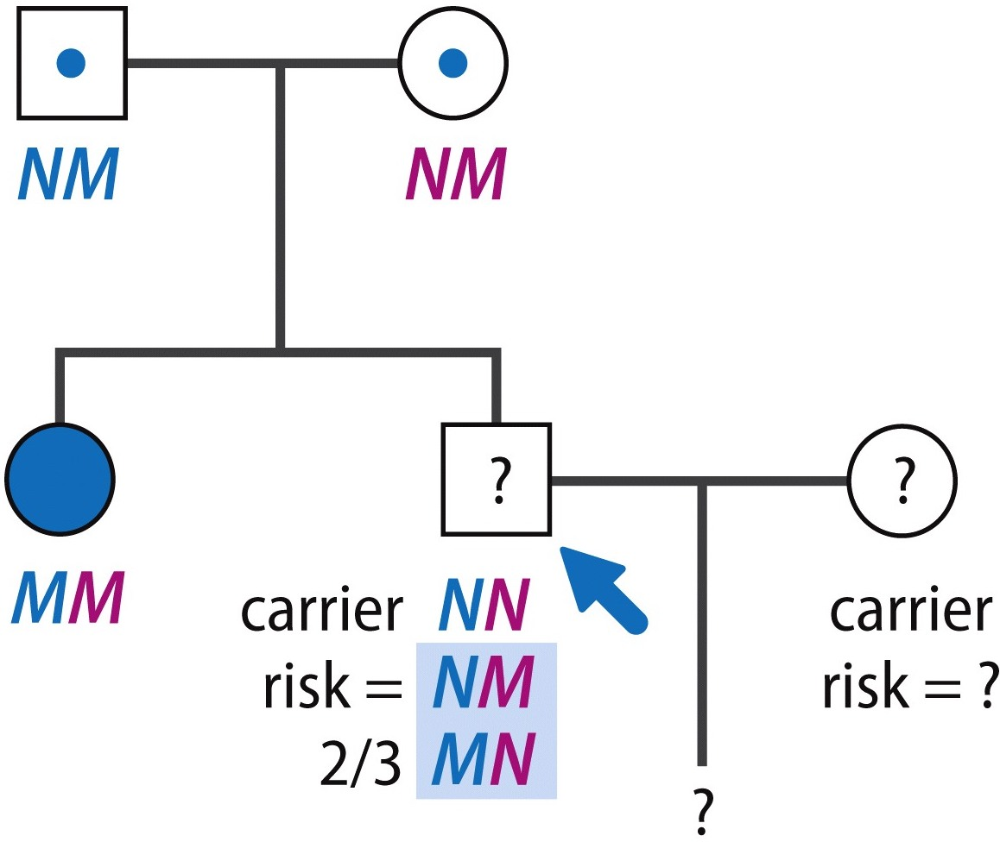
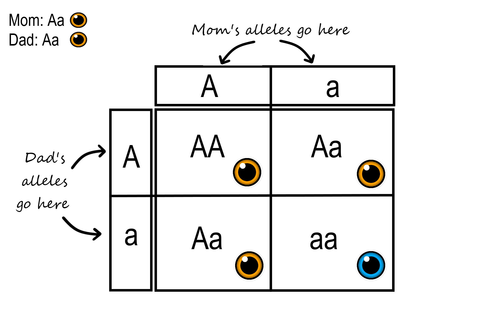

# Human Molecular Genetics
## MBB 438

### We talk about a diverse range of topics related to human genetics and genetic diseases. We discuss recent advances in the field including genome analysis, gene therapy, genetic testing, and studies of genetic disorders. This lecture and seminar course will cover the topics listed below and will integrate primary research papers into the topics.

## Topics

* Human genetic disease
* Disease gene mapping and characterization
* Gene therapy using Crispr
* Cloning and stem cells
* Genetic counselling
* Cancer genetics
* Animal models of disease

## INSTRUCTOR:
### Esther Verheyen

### Scientist by day, superhero by night (TENTATIVE)

