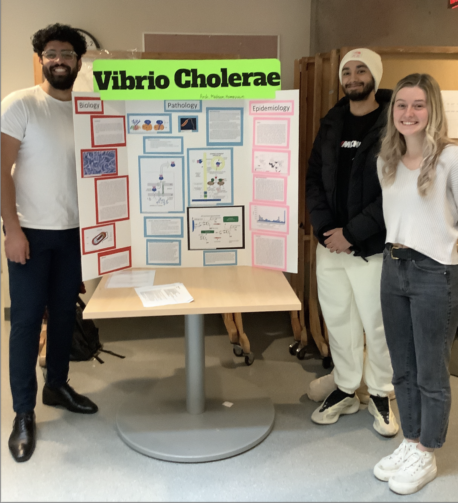

# Microbial Pathogenesis
## MBB 445

### Explore the biology of viruses and bacteria and the deadly diseases they cause. 

## Topics

* Viruses
* Bacteria
* Immunology
* Vaccines
* Pandemic
* SARS-COV2
* HIV
* Cholera
* Sexually transmitted diseases
* Virulence factors

## INSTRUCTORS:
### Mark Brockman ~ Virologist, immunologist, hypnotist

### Lisa Craig ~ Structural biologist and magician

