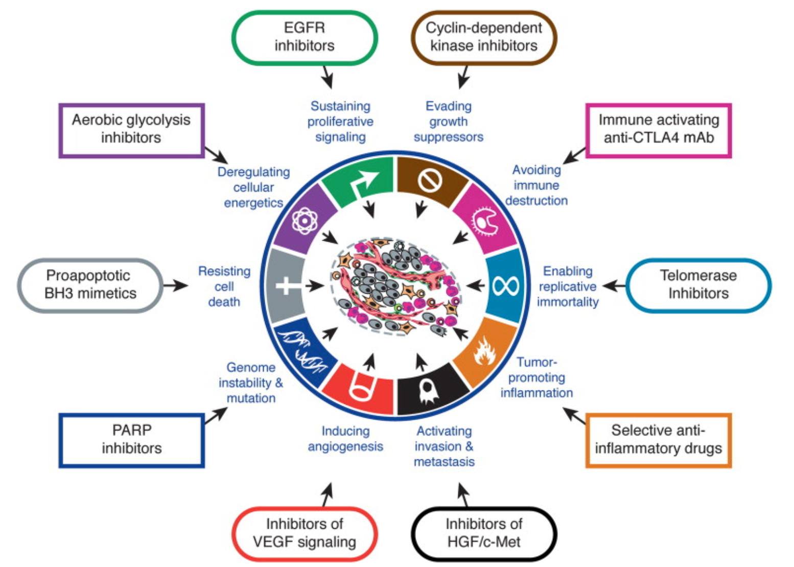

# The Molecular Biology of Cancer
## MBB 446

### An examination of the molecular mechanisms that contribute to tumor formation, the hallmarks of cancer and their relationship to therapeutic strategies. 

## Topics

* Hallmarks of cancer
* Cancer progression and metastasis
* Cancer research origins
* Microbes and cancer
* Oncogenes and tumor suppressors
* p53 and cell death
* Autophagy and cell survival
* Epigenetics and cancer
* Synthetic lethality strategies in cancer therapy
* Clonal evolution and cancer stem cells
* Biomarkers
* Drug development and clinical trials
* Cancer immunology
* Personalized medicine 

## INSTRUCTOR:
### Sharon Gorski ~ Outdoor enthusiast (hiking, kayaking)

