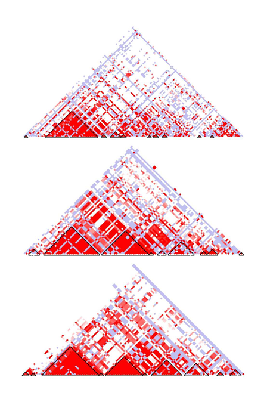
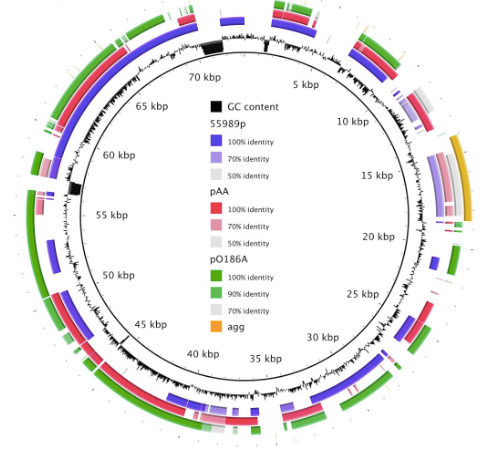
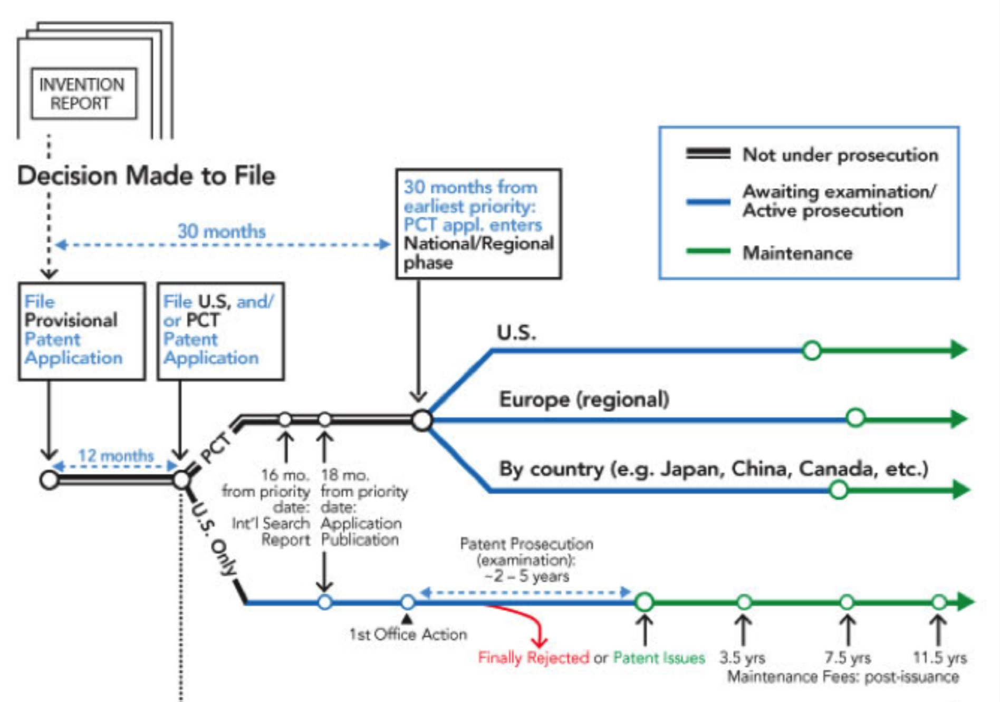

# Human Genomics
## MBB 462

### This course will explore the organization of the human genome and the role of genome variation in health and disease.  A broad range of topics will be covered including, for example, human genetic history, immunogenomics, pharmacogenomics, neurogenomics, genomics technologies and genetic engineering. We will also cover the business of genomics, including direct-to-consumer genetic testing, intellectual property issues and the biotechnology industry.  

## Topics

* Human genetic history and evolution
* Germline variation
* Genetic disease
* Genes and regulation
* Genome-wide association studies
* Transcriptomics
* Pharmacogenomics
* Somatic mutations and cancer
* Immunogenomics
* Application of gene therapy and cell-based therapies to cancer
* Intellectual property and patenting in human genetics
* Neurogenomics

## INSTRUCTORS:
### Rob Holt ~ Swiftie with an adaptive immunity to all the haters

### Sophie Sneddon ~ Bioinformatician, video game enthusiast, and cat person

