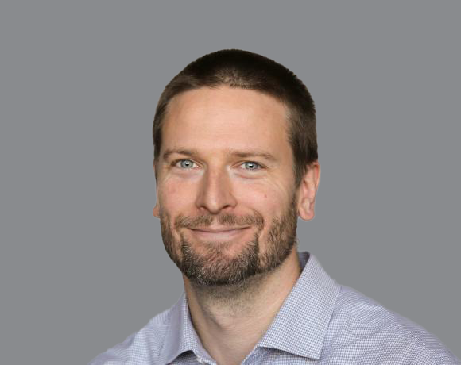
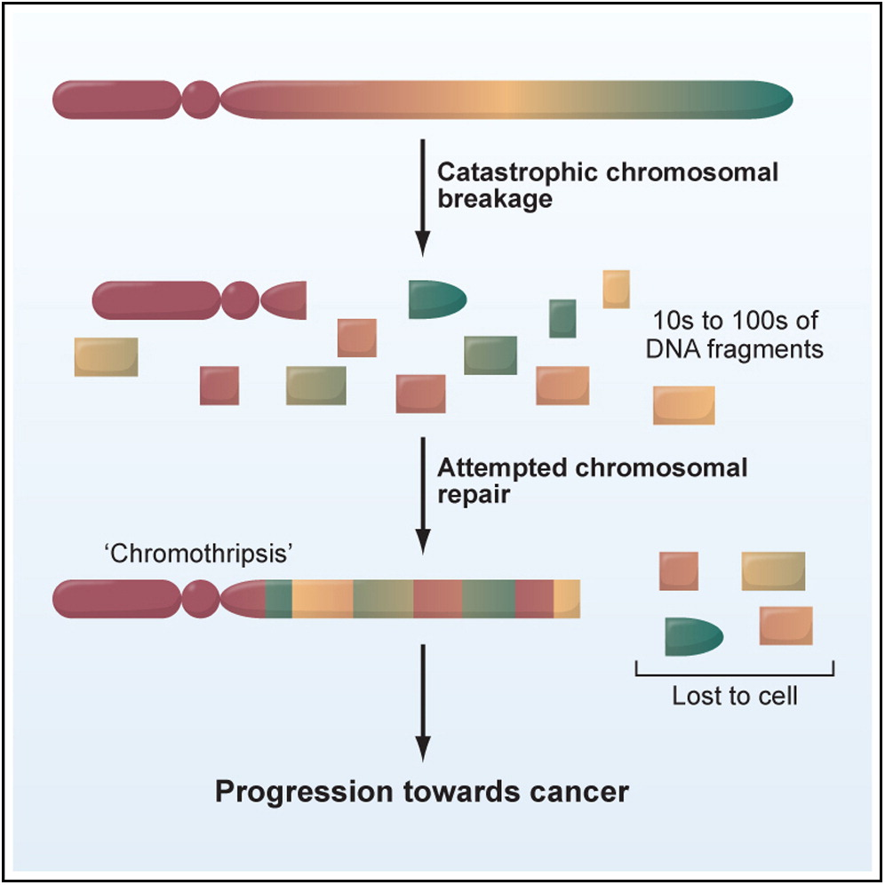
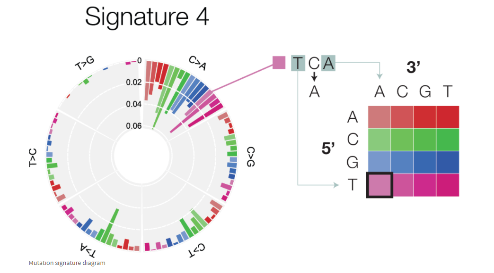
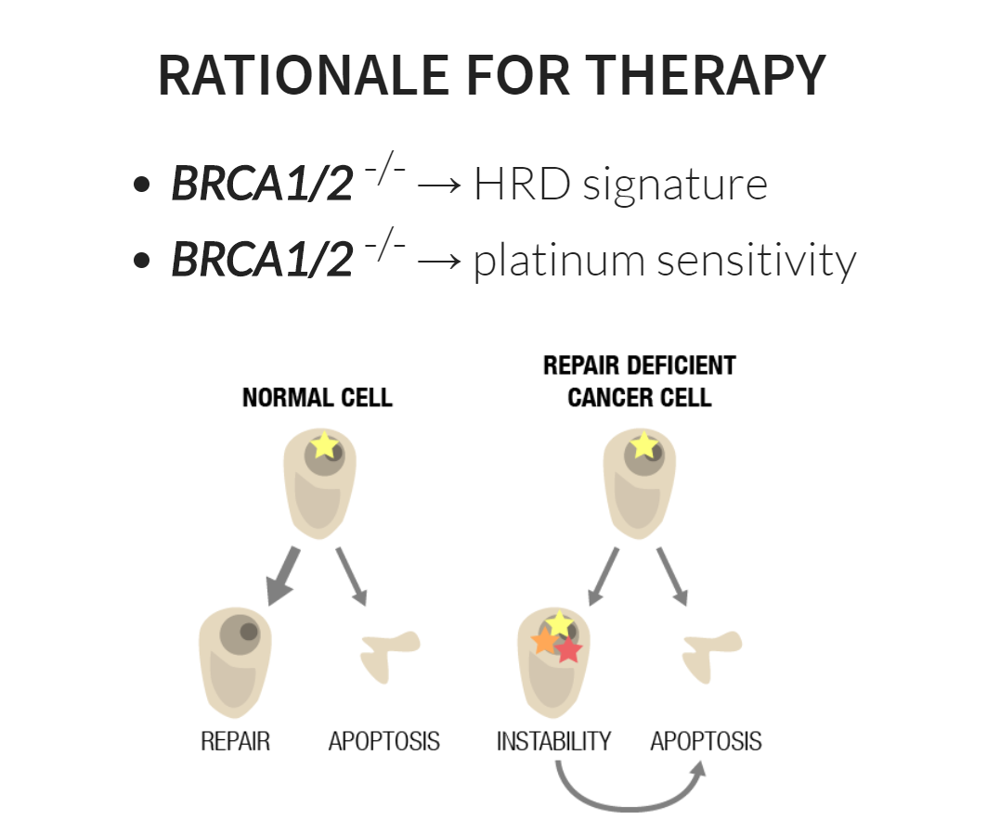

# CANCER GENOMICS

### An examination of the genomic changes that accrue during the formation and treatment of human cancer. The course will examine the role that genetic mutations play in the development of human cancer and tumour formation. We will study the spectrum of different types of genetic alterations that accrue and their distribution across different cancer types.   We will study the technologies that allow these changes to be detected and how they are interpreted clinically. Students with credit for MBB 460 under the title "Cancer Genomics" may not take this course for further credit.

## Topics

* Cancer sequencing
* Tumour heterogeneity
* DNA repair
* Hereditary cancer
* Treatment resistance
* Neo-antigens and immunotherapy  
* CART-therapies
* Cancer epigenomics
* Gene expression and alternative splicing in cancer
* Personalized oncogenomics
* Mutational signatures

## INSTRUCTOR:
### Ryan Morin ~ Just a regular everyday normal guy

