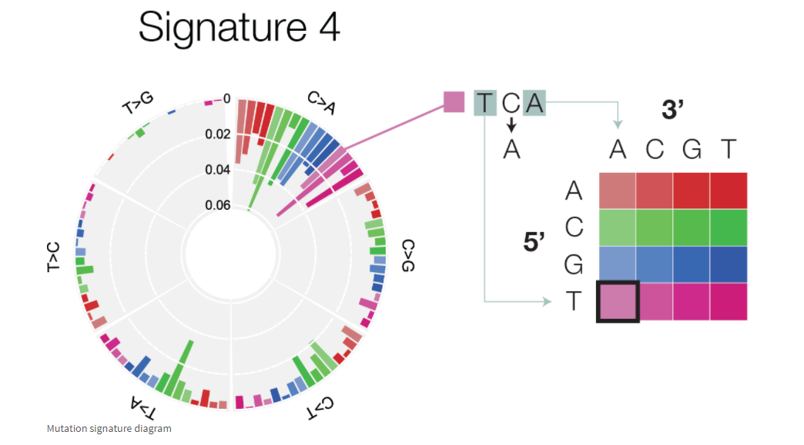

# Molecular Epidemiology of Infectious Disease 

### This senior seminar course will provide a broad overview of the application of modern molecular and genomics methods to infectious disease epidemiology. Topics will include the identification, classification, characterization, and monitoring of pathogens in human populations; the application of molecular methods to screening, prevention and treatment of infectious diseases; and the analysis of molecular and genomics data for disease. Globally relevant diseases such as salmonellosis, TB, COVID, and influenza will be highlighted.

## Topics

* pandemic response
* outbreak investigation
* genomic epidemiology
* high-throughput sequencing
* microbial population structure
* microbial genomics
* outbreak investigation
* bioinformatics
* molecular diagnosis
* molecular typing
* public health surveillance
* disease control and prevention"

## INSTRUCTOR:
### William Hsiao

